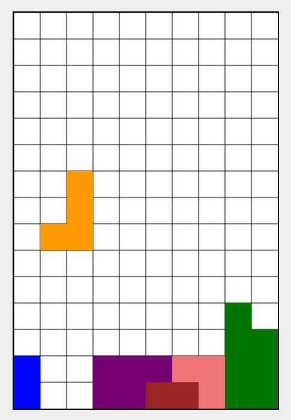

# Tetris Fantasy JS

  

### About

This game is a small exercise in programming logic. It features a visual representation of a matrix that simulates the logic behind a Tetris game. Some functionalities are still under development. Check out the roadmap below to see the planned features:

- [ ] Block Movement – Add collision detection with already placed blocks
- [ ] Game – Implement a point system
- [ ] Game – Add a game over check and screen

### How to Run the Game

1. Clone this repository
2. Run the command: `yarn dev`
3. In your browser, open: [http://localhost:5173/](http://localhost:5173/)
